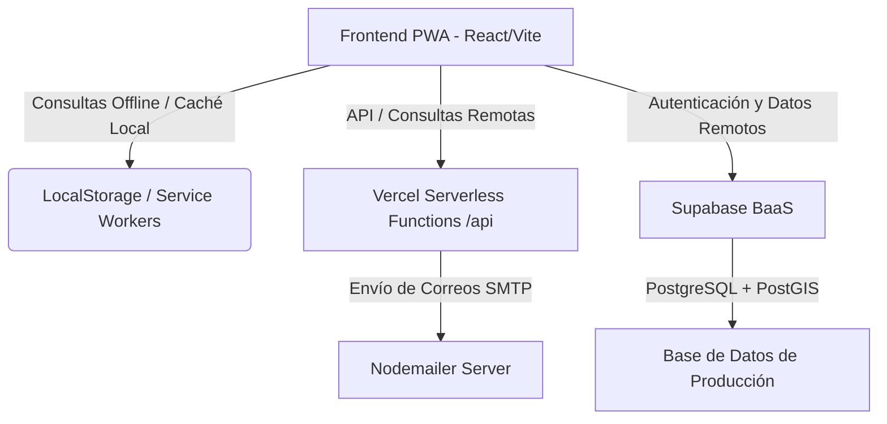

# GUAIKE.DÍAZ 🗺️🏺
> **Sistema de Información Geoespacial y Directorio Cultural PWA del Municipio Díaz, Nueva Esparta.**

GUAIKE.DÍAZ es una aplicación web progresiva (PWA) de nivel premium diseñada para cartografiar, promover y guiar a los visitantes a través de los talleres artesanales y tradicionales del Municipio Díaz (San Juan Bautista, Zabala, El Espinal, etc.). El sistema integra georreferenciación exacta, un planificador de rutas inteligente con resolvedor del Problema del Viajante (TSP) offline, validación de visitas físicas por código QR y un robusto esquema de seguridad de datos.

---

## 🏛️ Arquitectura del Sistema

El sistema utiliza una arquitectura moderna desacoplada con capacidades de funcionamiento offline de primer nivel:



1. **Frontend SPA / PWA:** Desarrollado con **React + Vite + TypeScript**. Implementa `vite-plugin-pwa` para almacenamiento persistente y carga instantánea, permitiendo planificar rutas e interactuar con el mapa incluso sin conexión a internet.
2. **Funciones Serverless (Vercel API):** Funciones de backend ubicadas en `/api` (ej. `auth-email.ts`, `send-email.ts`) encargadas del broker de autenticación, generación de plantillas de correo y transporte seguro de e-mails usando **Nodemailer**.
3. **Base de Datos y Seguridad (Supabase):** Base de datos **PostgreSQL 15** con la extensión geoespacial **PostGIS** habilitada. Todas las tablas están protegidas mediante políticas RLS (Row Level Security) y triggers de hardening de base de datos.

---

## 🚀 Módulos y Funcionalidades Clave

### 1. Registro Segmentado y Ficha de Operador
* **UX de Registro Interactivo:** Pantalla de selección inicial mediante tarjetas interactivas de rol (**Turista** vs. **Operador**). El formulario se adapta dinámicamente según la selección, ocultando campos sensibles.
* **Hardening de Datos del Operador:** Validación estricta en el cliente y servidor:
  * **Edad Mínima:** Los operadores deben ser mayores de 18 años.
  * **Datos Fiscales:** Validación y formato del RIF (letras J/G/V/E seguidas de 8 o 9 dígitos).
  * **Carga de Imágenes Cloudinary:** Carga fluida a Cloudinary con codificación offline en Base64 como fallback si el usuario pierde la conexión durante el registro.
* **Triggers de Hardening en Supabase:** Trigger de seguridad `handle_new_user()` que intercepta la creación del usuario para evitar escalamiento de privilegios (fuerza a cualquier rol no válido a convertirse en `turista`).

### 2. Autenticación y Seguridad UX
* **Visualización de Contraseñas por Pulsación Sostenida:** Implementación con eventos `onMouseDown`/`onTouchStart` y `onMouseUp`/`onTouchEnd` para revelar las contraseñas temporalmente y enmascararlas de forma automática al soltar.
* **Cambio Forzado de Clave Temporal:** Al iniciar sesión por primera vez con una clave provisional de administración, el sistema bloquea el dashboard hasta que el usuario establezca una contraseña fuerte propia.
* **Normalización Telefónica:** Validación y formateo telefónico automático para prefijos válidos de Venezuela (+58 / 0412 / 0414 / 0416 / 0424 / 0426) seguidos por 7 dígitos.

### 3. Georreferenciación, PostGIS y Geo-Fencing
* **Decodificación EWKB:** Decodificador nativo en TypeScript para coordenadas codificadas en formato binario hexadecimal (Extended Well-Known Binary) retornado por PostGIS, traduciéndolo a coordenadas WGS84 `[latitud, longitud]`.
* **Geo-Fencing en Díaz:** Validación estricta que impide registrar talleres fuera del límite geográfico legal del Municipio Díaz:
  * **Latitud:** `10.84` a `11.06`
  * **Longitud:** `-64.06` a `-63.88`
* **Controladores Leaflet:** Uso de máscaras poligonales y controladores dinámicos de encuadre (`MapBoundsController`) para auto-ajustar la vista del mapa según los puntos de interés cargados.

### 4. Planificador de Itinerarios y resolvedor TSP (Offline-First)
* **Algoritmo TSP Local:** resolvedor local de rutas utilizando la heurística del **Vecino Más Cercano (Nearest Neighbor)** para calcular el orden de visitas más eficiente entre los talleres seleccionados. Corre 100% en el cliente de forma offline.
* **Fórmula de Haversine Avanzada:** Cálculo de distancias geográficas aplicando un coeficiente de curvatura real del terreno de **1.35** para modelar adecuadamente las calles frente a la distancia aérea recta.
* **Historial de Rutas:** Guardado, carga y eliminación de itinerarios en `localStorage`. Cada parada incluye redirecciones optimizadas a Google Maps con el modo seleccionado (caminando/auto) y enlaces rápidos a WhatsApp.

### 5. Escáner QR de Validación y Reseñas
* **Escaneo QR con html5-qrcode:** Los turistas pueden usar la cámara de su dispositivo para escanear el código QR único del taller artesanal o introducir un código manual.
* **Desbloqueo de Reseñas:** Para evitar spam y garantizar la veracidad de las opiniones, solo los turistas que hayan verificado físicamente su presencia mediante el código QR (`isQrVerified`) pueden redactar y enviar una reseña calificada.
* **Optimismo Offline:** Permite registrar reseñas locales sin conexión, las cuales se sincronizan automáticamente una vez detectada la red.

---

## 📂 Estructura de Directorios

El repositorio se organiza de la siguiente manera:

* `frontend/` - Cliente React + Vite + TypeScript (PWA, mapas, TSP, escáner).
  * `src/components/` - Componentes comunes (SEO, botones, capas de Leaflet).
  * `src/views/` - Páginas principales (Login, Registro, Detalle de Operador, Itinerarios, Escáner).
  * `src/services/api.ts` - Cliente API unificado con colas de sincronización offline.
  * `src/utils/` - Utilidades lógicas (`geo.ts` para PostGIS/Límites, `authUser.ts`).
* `api/` - Funciones Serverless de Vercel (envío de correos, autenticación local).
* `database_schema.sql` - Estructura SQL de producción con extensiones geoespaciales, tablas e índices.
* `vercel.json` - Configuración del enrutamiento de funciones serverless y SPA en Vercel.

---

## 🧹 Limpieza y Archivos Deprecados

Durante el ciclo de desarrollo y la migración al modelo Serverless de Vercel + Supabase, ciertos componentes de la raíz han quedado deprecados y pueden ser removidos para mantener el proyecto limpio:

### ⚠️ Archivos que se pueden eliminar sin problema:
1. **`backend/` (Completo):** El servidor monolítico Express ya no se utiliza en producción, puesto que toda la lógica del backend fue absorbida por las funciones serverless de Vercel (`/api`) y el BaaS de Supabase.
2. **`backend/migrations/`:** Las migraciones locales de la base de datos de Express están en desuso. En su lugar, el esquema principal se gestiona directamente desde `database_schema.sql` en Supabase.
3. **`docker-compose.yml`:** Diseñado originalmente para orquestar la base de datos y el servidor de desarrollo local. Dado que se utiliza Supabase en la nube para persistencia y pruebas, este archivo ya no es necesario.
4. **`postman/`:** Colecciones de pruebas para el servidor Express deprecado.

---

## 🛠️ Instalación y Configuración Local

### Requisitos previos:
* Node.js v20 o superior
* npm v10 o superior

### Pasos para ejecutar:

1. **Instalar Dependencias de la Raíz y los Entornos:**
   ```bash
   npm install
   ```

2. **Configuración de Variables de Entorno (.env en frontend/):**
   Crea un archivo `.env` dentro de la carpeta `frontend/` con los datos de tu instancia de Supabase y Cloudinary:
   ```env
   VITE_SUPABASE_URL=https://tu-proyecto.supabase.co
   VITE_SUPABASE_ANON_KEY=tu-clave-anonima-supabase
   VITE_CLOUDINARY_UPLOAD_PRESET=tu-preset-cloudinary
   VITE_CLOUDINARY_CLOUD_NAME=tu-cloud-name
   ```

3. **Configuración de Variables para la API Serverless (.env en la raíz):**
   Para el correcto funcionamiento de las funciones de correo en Vercel:
   ```env
   SMTP_HOST=smtp.ejemplo.com
   SMTP_PORT=587
   SMTP_USER=tu-usuario-smtp
   SMTP_PASS=tu-clave-smtp
   SMTP_FROM=noreply@guaikediaz.com
   SUPABASE_SERVICE_ROLE_KEY=tu-service-role-key-supabase
   ```

4. **Ejecutar en Entorno de Desarrollo:**
   Inicia el servidor local de Vite:
   ```bash
   npm run dev
   ```
   La aplicación se abrirá en `http://localhost:5173`.

5. **Construir para Producción (Verificación PWA):**
   ```bash
   npm run build
   ```
   Los archivos compilados listos para desplegar se ubicarán en `frontend/dist/`.

---

## 🔐 Inicialización de la Base de Datos (Supabase)

Para recrear el esquema de base de datos en Supabase:
1. Habilita la extensión `postgis` en el panel de extensiones de Supabase.
2. Ejecuta el archivo `database_schema.sql` desde el editor SQL de Supabase.
3. Ejecuta los triggers de seguridad y sincronización (disponibles en `fix_register_trigger.sql`).
