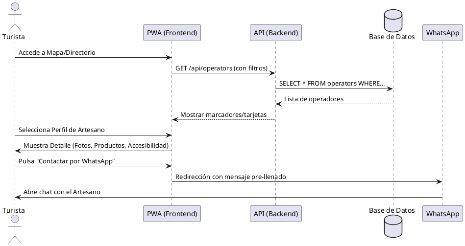
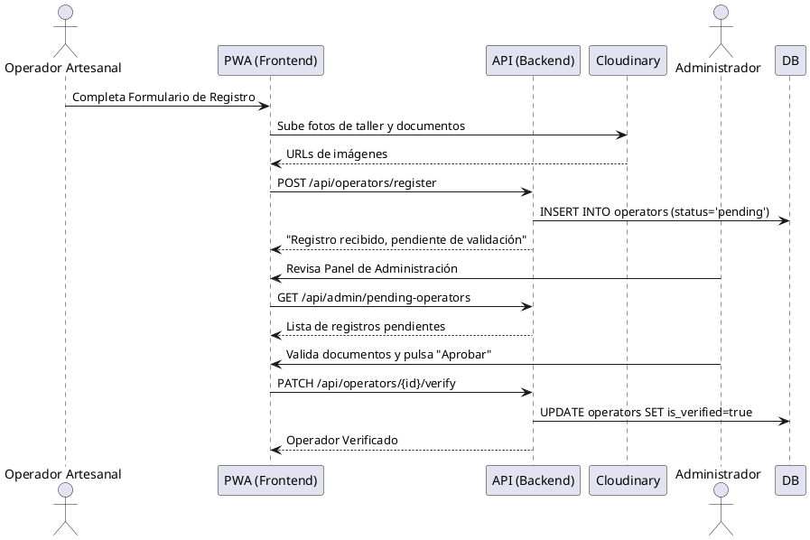
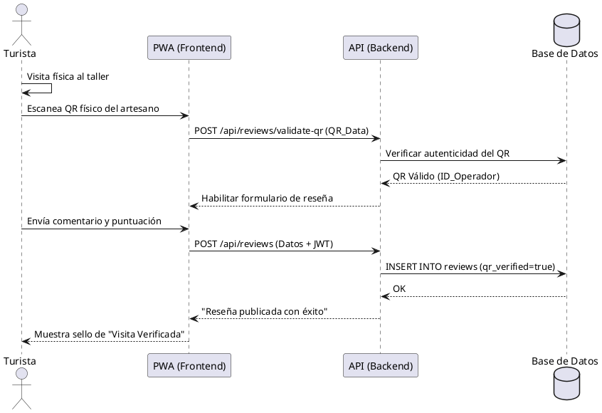
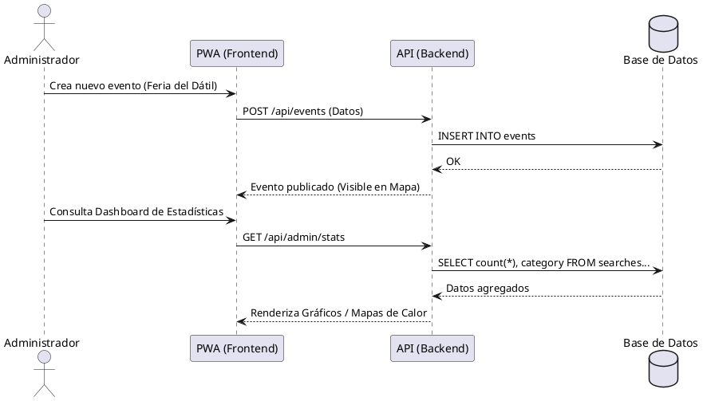

# Flujos de Interacción: GUAIKE.DÍAZ

Este documento describe detalladamente cómo interactúan los distintos usuarios con el sistema a través de diagramas de secuencia.

## 1. Descubrimiento y Contacto (Turista)
El flujo básico donde un visitante localiza a un artesano y establece contacto.

---

## 2. Registro y Verificación (Operador)
El proceso de formalización digital de un nuevo artesano.

---

## 3. Reseña Verificada vía QR (Turista + Operador)
Garantiza que las calificaciones provienen de visitas reales.

---

## 4. Gestión de Eventos y Estadísticas (Alcaldía)
Uso de la información para la toma de decisiones.

