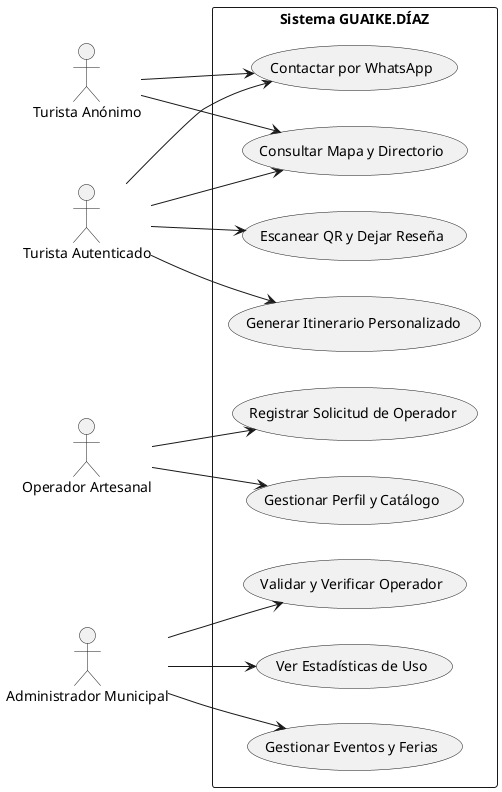
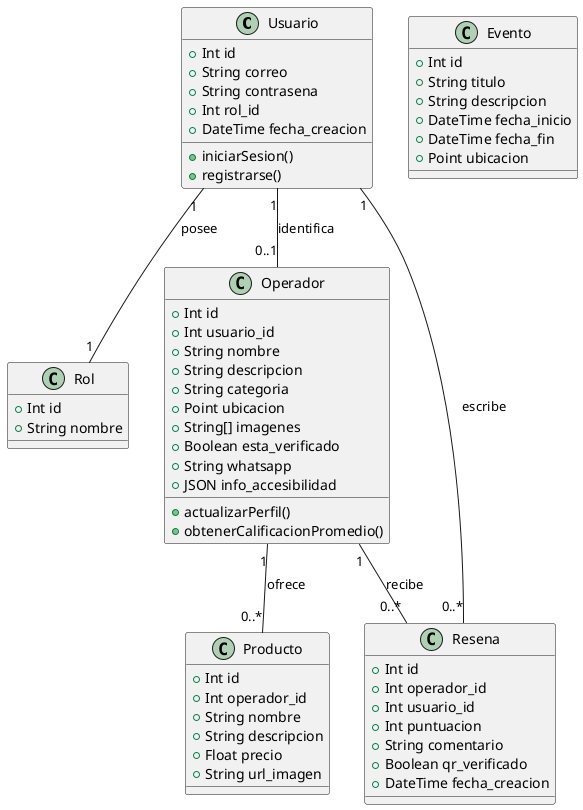
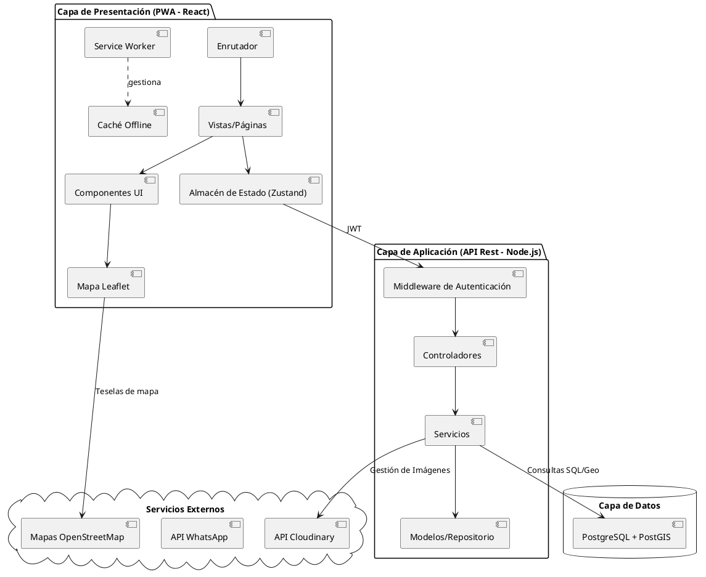

# Diagramas UML: GUAIKE.DÍAZ (PlantUML)

Este documento contiene la arquitectura visual del sistema mediante diagramas PlantUML en español.

## 1. Diagrama de Casos de Uso
Describe las interacciones entre los actores y las funcionalidades del sistema.

---

## 2. Diagrama de Clases
Representa la estructura de datos y las relaciones entre las entidades.

---

## 3. Diagrama de Componentes
Describe la organización de los módulos del sistema.

---
> [!TIP]
> Los diagramas de clases y casos de uso ya incorporan las nuevas funcionalidades solicitadas: **WhatsApp**, **Accesibilidad**, **Eventos** y **Reseñas verificadas por QR**.
