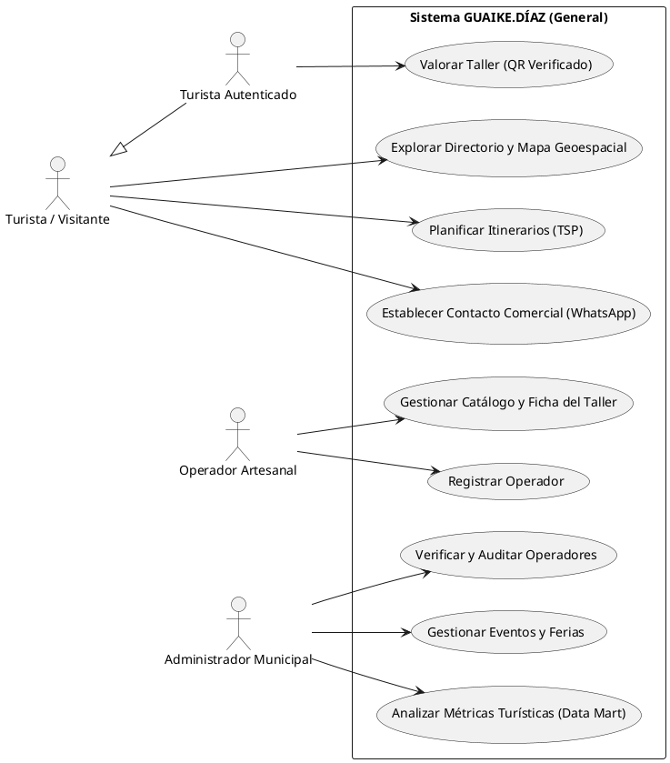
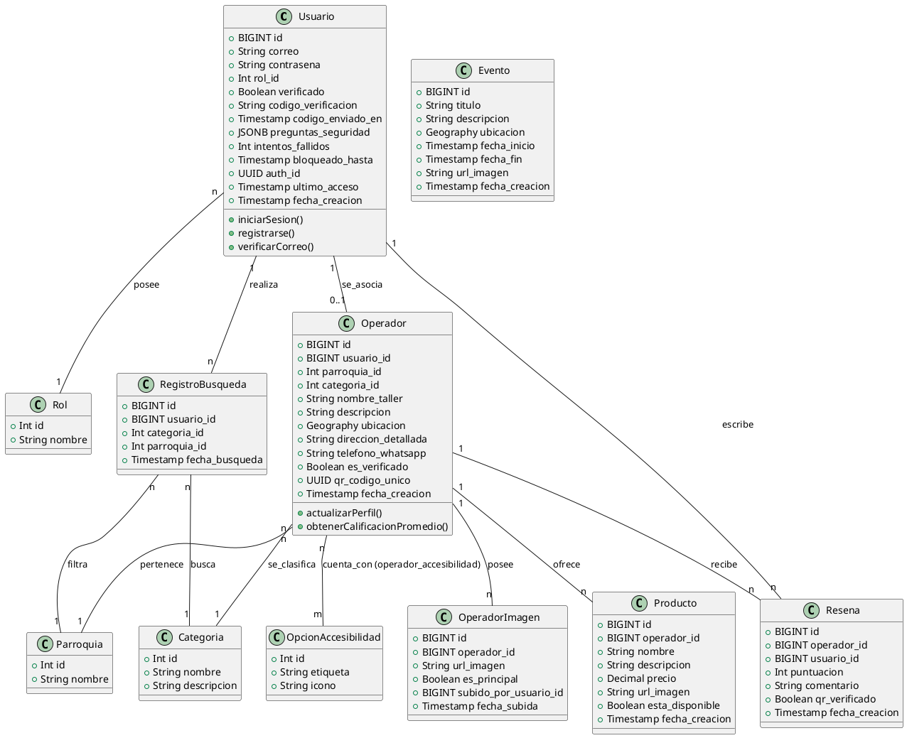
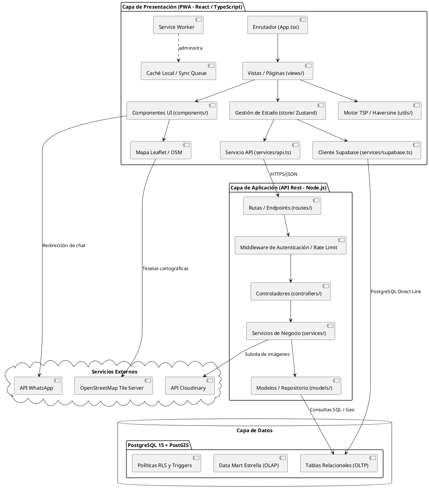

# Diagramas UML: GUAIKE.DÍAZ (PlantUML)

Este documento contiene la arquitectura visual del sistema mediante diagramas PlantUML en español, actualizados para reflejar fielmente la estructura real de la base de datos, la organización del código y el diseño de la solución actual.

---

## 1. Diagrama de Casos de Uso
Describe las interacciones de los distintos roles de usuario con las funcionalidades generales del sistema, simplificando la representación mediante herencia de actores.

---

## 2. Diagrama de Clases
Representa las entidades del sistema, sus atributos con tipado físico correspondiente al esquema de PostgreSQL/PostGIS, métodos clave y relaciones de persistencia.

---

## 3. Diagrama de Componentes
Describe la organización modular del código en el frontend (React/Zustand), el backend (Express/Vercel Serverless), la base de datos (Supabase + PostGIS) y su interacción con servicios externos.

---
> [!NOTE]
> Los diagramas fueron reestructurados integralmente:
> 1. El **Diagrama de Casos de Uso** se simplificó agrupando acciones en casos de uso de negocio generales e incorporando herencia de actores (`Turista` -> `Turista Autenticado`).
> 2. El **Diagrama de Clases** incorpora los tipos de datos reales (`BIGINT`, `Geography`, `JSONB`, `Decimal`) y las tablas maestras (`Parroquia`, `Categoria`, `OpcionAccesibilidad`), así como las entidades de negocio añadidas (`OperadorImagen` y `RegistroBusqueda`).
> 3. El **Diagrama de Componentes** refleja la estructura física actual de directorios del proyecto (`views/`, `store/`, `services/`, `utils/`) y el flujo híbrido de peticiones a la API REST e integraciones directas con Supabase.
